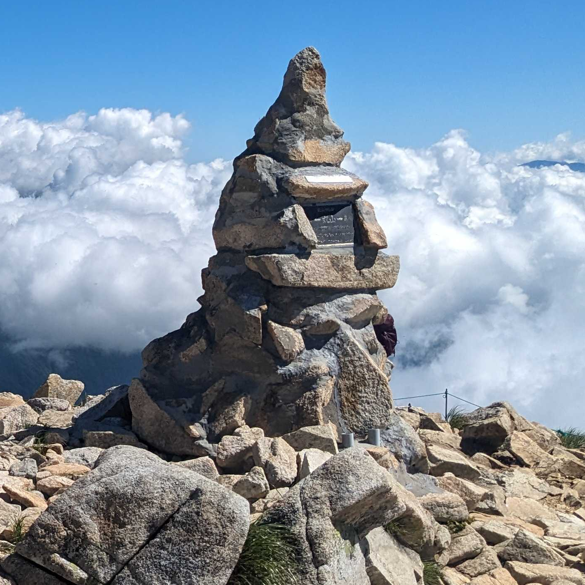
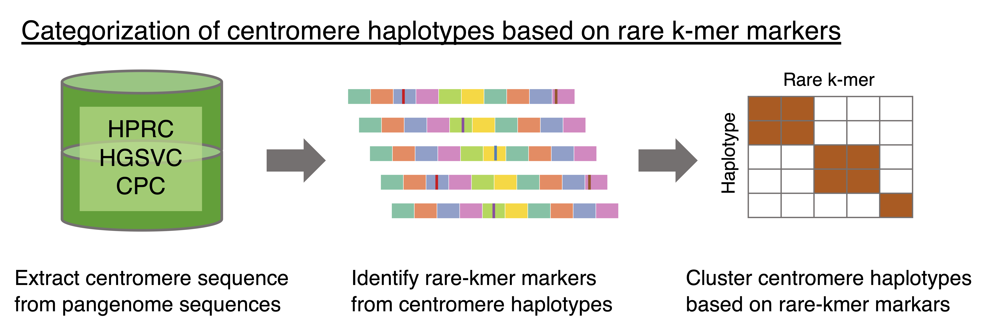

<div align="center">
  
  <p>Maruyama cairn at Mt. Karamatsu</p>
</div>

# ascairn
It has become clear that centromere sequences, especially alpha satellite sequences, exhibit considerable variation.
We have demonstrated that centromeres can be classified using rarely observed k-mers (Sugawa et al., in preparation).
`ascairn` (alpha-satellite cairn) is software designed to perform various analyses, including estimating centromere variation from short-read data by utilizing rare k-mers within centromere sequences

<div align="center">
  
</div>

# Dependency
## Software
- [samtools](https://github.com/samtools/samtools)
- [Jellyfish](https://github.com/gmarcais/Jellyfish)
- [mosdepth](https://github.com/brentp/mosdepth)

## Python
- click
- boto3 (required only for accessing CRAM files in Amazon S3)
  
# Installation

1. Install all prerequisite software and ensure they are accessible by adding their locations to your `PATH`.

2. Install `ascairn`.
```
git clone https://github.com/friend1ws/ascairn.git
cd ascairn
pip install . [--user]
```
> Note: The `--user` option is optional and can be used if you don't have administrative rights or if you prefer installing packages locally.

3. Download ascairn resource files.
```
git clone https://github.com/friend1ws/ascairn_resource.git
```

# Mini-Tutorial

This mini-tutorial demonstrates how to execute a standard workflow using the `ascairn_type_allchr.sh` script. 
This tutorial can be easily extended to any sequence data aligned to the GRCh38 reference genome.

## Workflow 
- `check_depth`　
  - Checks sequence coverage focusing on a reference region (long arm of chromosome 22)
  - Determines biological sex by assessing the coverage within a specified region of chromosome X (restricted here to the short arm), relative to the reference region.

- `kmer_count` 
  - Extracts reads aligned to alpha satellite regions and counts occurrences of predefined rare k-mers.

- `type`
  - Identifies centromeric cluster pairs and the closest haplotype pairs for chromosomes 1–22 and chromosome X.

## Procedure

### 1. Prepare the sequence data

Download a sequence data (aligned to the GRCh38 reference genome) using one of the following methods:

**Option 1: AWS S3 (recommended for faster downloads)**
```
aws s3 cp s3://1000genomes/1000G_2504_high_coverage/additional_698_related/data/ERR3989340/NA12877.final.cram seq_data/
aws s3 cp s3://1000genomes/1000G_2504_high_coverage/additional_698_related/data/ERR3989340/NA12877.final.cram.crai seq_data/
```

> If you have direct access to AWS S3 BAM or CRAM files and SAMtools is properly installed, you can skip downloading the files locally. Instead, directly specify the S3 path in subsequent steps.


**Option 2: FTP**
```
wget ftp://ftp.sra.ebi.ac.uk/vol1/run/ERR398/ERR3989340/NA12877.final.cram -P seq_data/
wget ftp://ftp.sra.ebi.ac.uk/vol1/run/ERR398/ERR3989340/NA12877.final.cram.crai -P seq_data/
```


### 2. Execute the `ascairn_type_allchr.sh` script
Run the following command (runtime: approximately 20–30 minutes):
```
bash ascairn_type_allchr.sh seq_data/NA12877.final.cram output/NA12877 ascairn_resource/resource/ver_2024-12-06 8
```

**Argument Descriptions:**
- **First argument**: Path to BAM or CRAM file.
- **Second argument**: Output path prefix.
- **Third argument**: Path to the ascairn resource data.
- **Fourth argument**: Number of threads to use (optional, default: 8).

**Result**
After successful execution, you will find the output file at:
```
output/NA12877.cen_type.result.txt
```

