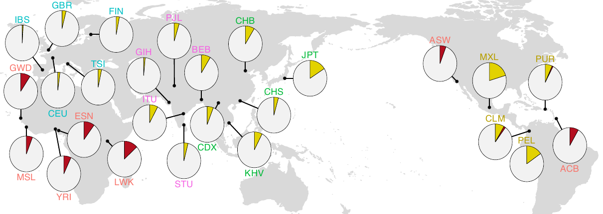

# Applications

ascairn enables centromere haplogroup analysis in short-read whole-genome sequencing datasets. This makes it possible to study centromere variation in cohorts where complete long-read centromere assemblies are unavailable.

## Population-scale centromere variation

One major use case is population-scale analysis. By applying ascairn to short-read WGS data, each individual can be assigned chromosome-specific centromere haplogroups. These assignments can then be summarized as haplogroup allele frequencies across populations.

In the ascairn study, this approach was applied to large public WGS cohorts, including the 1000 Genomes Project and the Human Genome Diversity Project. The resulting haplogroup frequencies showed substantial population structure. Many centromere haplogroups were enriched in specific populations or superpopulations, and African populations showed particularly high haplogroup diversity, consistent with broader patterns of human genetic diversity.

  

This example shows the population distribution of chromosome 19 haplogroups associated with an inactive alpha satellite HOR insertion. It illustrates how ascairn assignments can be summarized across cohorts to study population-specific centromere lineages.

## Interpreting population results

Population-level haplogroup frequencies should be interpreted as variation at individual centromeres, not as genome-wide ancestry inference. A sample has separate haplogroup assignments for each chromosome. Aggregating those assignments across chromosomes can reveal broad population structure, but the primary unit of analysis remains the chromosome-specific centromere haplogroup.

Haplogroup distributions can also highlight centromere lineages associated with shared structural features. For example, haplogroups carrying related structural variants may show different frequencies across populations, suggesting lineage diversification and population history within centromeric regions.

## Cancer and structural rearrangement analysis

ascairn can also be used in disease cohorts when short-read tumor and matched normal data are available. In the ascairn study, normal samples from oligodendroglioma cases with 1p/19q co-deletion were typed to infer chromosome 1 and chromosome 19 centromere haplogroups and proxy haplotypes. Rare k-mers specific to the two inferred proxy haplotypes were then used to track allele-specific copy-number shifts in tumor data.

This analysis helped map rearrangement breakpoints to active alpha satellite HOR arrays and linked centromere haplotype structure to rearrangement susceptibility. This is an application built on top of ascairn's haplogroup and proxy haplotype assignments, rather than a separate default command in the core CLI.

## Practical use cases

ascairn is useful when you want to:

- compare centromere haplogroup profiles across many short-read WGS samples,
- summarize chromosome-specific centromere variation across populations,
- select proxy centromere haplotypes from a reference panel,
- investigate whether centromere haplogroups or proxy haplotypes are associated with downstream biological or clinical phenotypes.

ascairn is not a replacement for long-read centromere assembly. Instead, it provides a scalable way to project short-read samples onto a reference panel of assembled centromere haplotypes.
