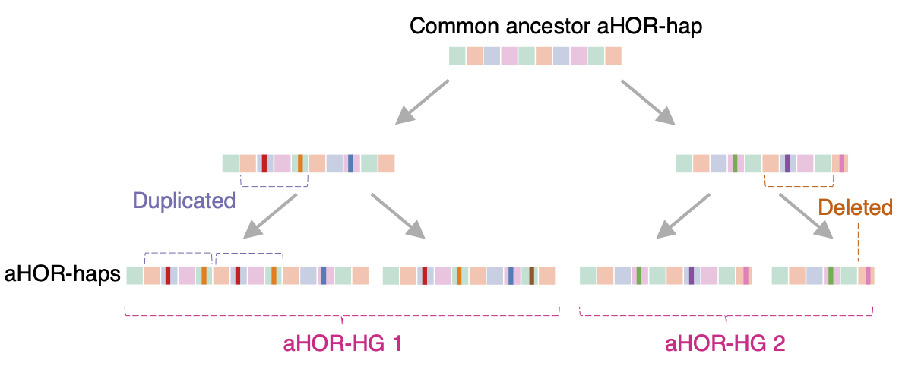
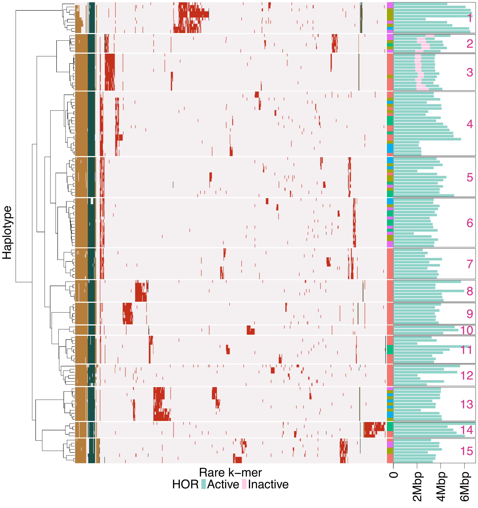

# Centromere Haplogroups

This page explains the biological objects that ascairn types: active alpha satellite higher-order repeat haplotypes and their haplogroups.

## Centromeres and active alpha satellite HOR arrays

Human centromeres are composed largely of alpha satellite DNA, which consists of approximately 171 bp monomers arranged into chromosome-specific higher-order repeat (HOR) arrays. Among these repeats, the active alpha satellite HOR arrays are associated with CENP-A and kinetochore formation. They are therefore central to chromosome segregation, but they are also among the most repetitive and structurally variable regions of the human genome.

Complete long-read assemblies have revealed that active alpha satellite HOR arrays vary substantially between individuals. They differ in array length, HOR organization, orientation, inserted sequence content, and the relative position of functional centromere features such as kinetochore-associated regions. These assembled active alpha satellite HOR sequences are referred to here as active alpha satellite HOR haplotypes, or aHOR-haps.

## Why rare k-mers are useful

Because aHOR arrays are repetitive and often megabases in length, it is difficult to define conventional variants against a single linear reference genome. ascairn instead uses an alignment-free marker system based on rare k-mers.

Rare k-mers are short sequences that occur infrequently within active alpha satellite HOR haplotypes. They often reflect small sequence changes, such as substitutions or short indels, that are inherited along centromeric lineages. When many rare k-mers are considered together, their presence and copy-number patterns capture relationships between centromeric haplotypes.

In the reference panel used by ascairn, rare k-mer profiles separate aHOR-haps into discrete chromosome-specific groups. These groups are called active alpha satellite HOR haplogroups, or aHOR-HGs.

  

## What is a centromere haplogroup?

In ascairn, a centromere haplogroup is a chromosome-specific cluster of aHOR-haps that share similar rare k-mer profiles. A haplogroup is not defined by one marker alone; it is defined by a pattern across many rare k-mers.

These haplogroups often correspond to evolutionarily related centromere lineages. In the reference panel, many haplogroups are supported by rare k-mers that are shared by haplotypes within the haplogroup and absent, or nearly absent, from other haplogroups. Some haplogroups also correspond to recognizable structural features, such as inversions, inserted inactive HOR sequences, or characteristic HOR organization.

Centromere haplogroups are chromosome-specific. For example, a chromosome 1 haplogroup and a chromosome 19 haplogroup describe variation at different centromeres and should not be interpreted as a single genome-wide ancestry label.

  

This chromosome 19 D19Z3 example shows how rare k-mer profiles cluster aHOR-haps into discrete haplogroups. The adjacent structural track illustrates that some haplogroups correspond to recognizable structural features, including insertion of inactive alpha satellite HOR sequence.

## Structural feature examples

Rare k-mer-based haplogroups can capture structural features even when the clustering itself is based only on k-mer profiles.

Examples described in the ascairn study include:

- chromosome 1 D1Z7 haplogroups associated with a large inversion,
- chromosome 19 D19Z3 haplogroups associated with insertion of inactive alpha satellite HOR sequence,
- chromosome 17 D17Z1 haplogroups associated with different HOR patterns,
- chromosome 7 and chromosome 11 haplogroups associated with atypical HOR structures.

These examples illustrate why haplogroup assignment can be biologically informative: the selected haplogroup provides a compact summary of centromere structure, while the selected proxy haplotype provides a reference sequence that approximates the individual's centromeric haplotype.

## Relationship to ascairn outputs

ascairn reports the most likely haplogroup pair for each chromosome. In the output files, these are shown as cluster assignments, such as `Cluster_1` and `Cluster_2`. For diploid chromosomes, the two assignments correspond to the two parental centromeric haplotypes. For haploid contexts, such as chromosome X in male samples or chromosome Y, ascairn uses single-haplotype mode.

ascairn also reports the nearest proxy haplotypes from the reference panel. These proxy haplotypes are not de novo assemblies of the input sample. They are reference-panel haplotypes selected because their rare k-mer profiles best explain the observed short-read data.
