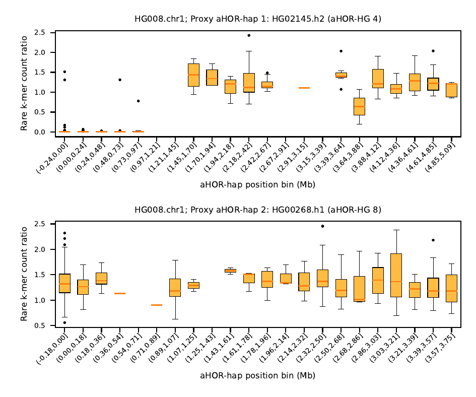

# Tutorial: somatic centromere CNA with `somatic_cna`

This tutorial walks through detecting somatic copy-number alterations (CNA) at a
centromere from a matched tumor/normal pair, using the public **HG008**
pancreatic cancer cell line from GIAB. The complete, runnable script is at
[`examples/run_somatic_cna.sh`](../examples/run_somatic_cna.sh); the steps below
explain it.

The idea: `cen_type` on the **normal** sample picks the two proxy aHOR-haps for a
centromere. `somatic_cna` then re-counts the same rare k-mers in the **tumor**
sample and reports, per marker, the tumor/normal ratio along the proxy
haplotype. A region of the centromere that is somatically lost in the tumor
shows a ratio dropping toward 0; a gain shows a ratio above 1.

## Prerequisites

Install ascairn with the S3 and plotting extras (S3 to read the BAMs, matplotlib
for the PDF — without it the command still writes the TSV and just skips the plot):

```bash
pip install ascairn[s3,plot]
```

Clone the reference panel ([ascairn_resource](https://github.com/friend1ws/ascairn_resource)):

```bash
git clone https://github.com/friend1ws/ascairn_resource.git
RESOURCE_DIR=ascairn_resource/resource/panel/ascairn_paper_2025
COMMON_DIR=ascairn_resource/resource/common
```

Download and index the reference the HG008 BAMs are aligned to (GRCh38-GIABv3):

```bash
REF=GRCh38_GIABv3_no_alt_analysis_set_maskedGRC_decoys_MAP2K3_KMT2C_KCNJ18.fasta
REF_URL=https://42basepairs.com/download/web/giab/release/references/GRCh38/${REF}.gz
curl -L ${REF_URL} | gunzip > ${REF}
samtools faidx ${REF}
```

The matched tumor/normal BAMs stay on the GIAB S3 bucket — ascairn reads only the
regions it needs directly from S3, so no BAM download is required:

```bash
S3=s3://giab/data_somatic/HG008/Liss_lab/Element_AVITI_20240626
NORMAL_BAM=${S3}/HG008-N-D_Element-StdInsert_72x_GRCh38-GIABv3.bam
TUMOR_BAM=${S3}/HG008-T_Element-StdInsert_102x_GRCh38-GIABv3.bam

mkdir -p output
```

Passing `-r ${REF}` (below) lets samtools skip the slow MD5-based reference lookup
when reading the S3 BAM (measured ~5x faster region extraction).

## Step 1 — depth on the normal

`cen_type` needs the normal coverage (and sex, for chrX handling).

```bash
ascairn check_depth ${NORMAL_BAM} \
    -o output/HG008-N.depth.txt \
    --baseline_region ${COMMON_DIR}/chr22_long_arm_hg38.bed \
    --x_region        ${COMMON_DIR}/chrX_short_arm_hg38.bed \
    -r ${REF} -t 4
```

## Step 2 — rare k-mer counts for both normal and tumor

The same k-mer set is counted in each sample; the counts are what `somatic_cna`
pairs marker by marker.

```bash
for LABEL_BAM in "N:${NORMAL_BAM}" "T:${TUMOR_BAM}"; do
    LABEL=${LABEL_BAM%%:*}; BAM=${LABEL_BAM#*:}
    ascairn kmer_count ${BAM} \
        -o output/HG008-${LABEL}.kmer_count.txt \
        --kmer_file  ${RESOURCE_DIR}/rare_kmer_list.fa \
        --cen_region ${COMMON_DIR}/cen_region_curated_margin_hg38.bed \
        -r ${REF} -t 4
done
```

## Step 3 — type the normal centromeres

This assigns each chromosome's aHOR-HG pair and the proxy aHOR-hap pair, and
writes the `*.haplotype.marker_prob.txt` that `somatic_cna` consumes. Here we run
a single chromosome (chr1); loop over `$(seq 1 22) X` for the full genome.

```bash
CHR=1
ascairn cen_type output/HG008-N.kmer_count.txt \
    -o output/HG008-N.chr${CHR} \
    --kmer_info  ${RESOURCE_DIR}/kmer_info/chr${CHR}.kmer_info.txt.gz \
    --hap_info   ${RESOURCE_DIR}/hap_info/chr${CHR}.hap_info.txt \
    --depth_file output/HG008-N.depth.txt
```

## Step 4 — somatic CNA

Pair the tumor and normal counts on the normal-derived proxy haplotypes. The
normal `marker_prob` defines which proxy hap each marker belongs to.

```bash
ascairn somatic_cna \
    --marker_prob  output/HG008-N.chr${CHR}.haplotype.marker_prob.txt \
    --normal_count output/HG008-N.kmer_count.txt \
    --tumor_count  output/HG008-T.kmer_count.txt \
    --kmer_info    ${RESOURCE_DIR}/kmer_info/chr${CHR}.kmer_info.txt.gz \
    --hap_info     ${RESOURCE_DIR}/hap_info/chr${CHR}.hap_info.txt \
    -o output/HG008.chr${CHR}
```

This writes two files from the `-o` prefix:

- `output/HG008.chr1.somatic_cna.txt` — per-marker table
  (`Marker`, `Hap_pos`, `Haplotype`, `Normal_count`, `Tumor_count`, `Ratio`).
- `output/HG008.chr1.somatic_cna.pdf` — per-bin tumor/normal ratio boxplots,
  one panel per proxy aHOR-hap.

`--hap_info` is optional; supplying it adds the aHOR-HG (cluster) to the plot
titles. `--kmer_info` is required (it gives each marker's position and the
haplotype length used for binning).

## Reading the plot

<div align="center">
  
</div>

Each panel is one proxy aHOR-hap, with the title showing the hap name and its
aHOR-HG, e.g. `HG008.chr1; Proxy aHOR-hap 1: HG02145.h2 (aHOR-HG 4)`. The x-axis
bins span the haplotype length (Mb); the y-axis is the tumor/normal rare k-mer
count ratio. Markers with `Normal_count < 8` are dropped as low-confidence.

For HG008 chr1, proxy aHOR-hap 1 (top) shows a clear stretch of bins from the
start of the haplotype where the ratio collapses to ~0 — rare k-mers present in
the normal are absent in the tumor — indicating a somatic loss over that part of
the centromere, while proxy aHOR-hap 2 (bottom) stays near 1.

## Notes

- Run steps 3–4 per chromosome (`for CHR in $(seq 1 22) X; do ... done`). For a
  male sample, add `Y` and pass `--single_hap` to `cen_type` for chrX/chrY; the
  single-haplotype path is not plotted by `somatic_cna`.
- The ratio is `Tumor_count / Normal_count`, or `NA` when `Normal_count` is 0.
- This is a per-centromere, marker-level view; it is not a genome-wide CNA caller.
